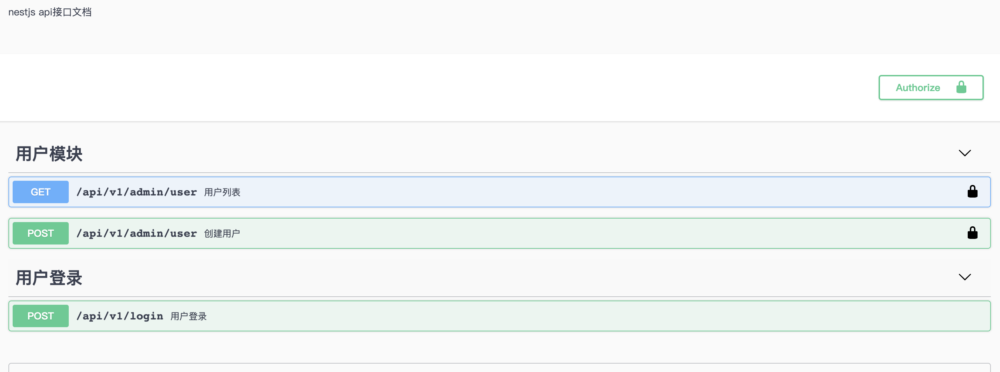

<p align="center">
  <a href="http://nestjs.com/" target="blank"></a>
</p>

<h3 align="center">一步一步教你搭建一个nestjs-mysql-api项目</h3>


## 一、使用官方脚手架及构建一个项目

* 1、[官网地址](https://docs.nestjs.com/cli/overview)

* 2、使用脚手架构建一个初始项目

* 3、查看常见的命令

  ```shell
  ➜  nest-learn git:(master) ✗ nest   
  Usage: nest <command> [options]
  
  Options:
    -v, --version                                   Output the current version.
    -h, --help                                      Output usage information.
  
  Commands:
    new|n [options] [name]                          Generate Nest application.
    build [options] [app]                           Build Nest application.
    start [options] [app]                           Run Nest application.
    generate|g [options] <schematic> [name] [path]  Generate a Nest element.
      Available schematics:
        ┌───────────────┬─────────────┐
        │ name          │ alias       │
        │ application   │ application │
        │ angular-app   │ ng-app      │
        │ class         │ cl          │
        │ configuration │ config      │
        │ controller    │ co          │
        │ decorator     │ d           │
        │ filter        │ f           │
        │ gateway       │ ga          │
        │ guard         │ gu          │
        │ interceptor   │ in          │
        │ interface     │ interface   │
        │ middleware    │ mi          │
        │ module        │ mo          │
        │ pipe          │ pi          │
        │ provider      │ pr          │
        │ resolver      │ r           │
        │ service       │ s           │
        │ library       │ lib         │
        │ sub-app       │ app         │
        └───────────────┴─────────────┘
    info|i                                          Display Nest project details.
    update|u [options]                              Update Nest dependencies.
    add [options] <library>                         Adds support for an external library to your project.
  ➜  nest-learn git:(master) ✗ 
  ```

* 4、一般使用命令创建组件、服务、守卫、管道

  ```typescript
  nest g gu guard/auth [--no-spec]
  ```

  

* 5、直接启动项目

* 6、我们今天要实现的功能

* 

## 二、对项目的基本配置

* 1、**使用`.env`文件存放敏感信息或者配置信息**

  * 安装依赖包

    ```shell
    npm install dotenv
    npm install @types/dotenv -D
    ```

  * 项目下创建.env的文件

  * 在`main.ts`中使用

    ```typescript
    import 'dotenv/config';
    import { NestFactory } from '@nestjs/core';
    import { Logger } from '@nestjs/common';
    
    import { AppModule } from './app.module';
    
    const PORT = process.env.PORT || 8080;
    const PREFIX = process.env.PREFIX || '/';
    
    async function bootstrap() {
      const app = await NestFactory.create(AppModule);
    
      // 给请求添加prefix
      app.setGlobalPrefix(PREFIX);
      await app.listen(PORT, () => {
        Logger.log(`服务已经启动,请访问:http://wwww.localhost:${PORT}/${PREFIX}`);
      });
    }
    bootstrap().catch(e => Logger.error(e));
    ```

* 2、使用`nest-config` 配置

  * 安装依赖包

    ```shell
    npm install nestjs-config
    ```

  * 项目根目录下创建一个`config`的目录

  * 直接在`app.module.ts`中引入配置

    ```shell
    import * as path from 'path';
    
    import { Module } from '@nestjs/common';
    import { ConfigModule } from 'nestjs-config';
    
    import { AppController } from './app.controller';
    import { AppService } from './app.service';
    
    @Module({
      imports: [
        ConfigModule.load(path.resolve(__dirname, 'config', '**/!(*.d).{ts,js}'), {
          modifyConfigName: (name: string) => name.replace('.config', ''),
        }), // 配置加载配置文件
        ConfigModule,
      ],
      controllers: [AppController],
      providers: [AppService],
    })
    export class AppModule { }
    ```

* 3、配置引包别名(`tsconfig.json`文件中)

  ```shell
  // 配置引包的别名
  "paths": {
    "@src/*": [
    	"src/*"
  	]
  }
  ```

* 4、配置跨域访问

  ```typescript
  const app = await NestFactory.create<NestExpressApplication>(AppModule, {
    cors: true, // 设置跨站访问
    logger: false,
  });
  ```

* 5、访问频率的限制

  * [官网地址](https://docs.nestjs.com/techniques/security#rate-limiting)

  * 安装包

    ```typescript
    npm install express-rate-limit
    ```

  * 在`main.ts`中使用

    ```typescript
    // 访问频率限制
    app.use(
      rateLimit({
        windowMs: 15 * 60 * 1000, // 15分钟
        max: 100, // 限制15分钟内最多只能访问100次
      }),
    );
    ```

* 6、`web`漏洞的配置

  * [官网地址](https://docs.nestjs.com/techniques/security#helmet)

  * 安装包

    ```typescript
    npm install helmet
    ```

  * 使用

    ```typescript
    // Web漏洞的
    app.use(helmet());
    ```

## 三、配置`mysql`

* 1、[官网地址](https://docs.nestjs.com/recipes/sql-typeorm)

* 2、安装的依赖包

  ```shell
  npm install --save @nestjs/typeorm typeorm mysql
  ```

* 3、在`.env`文件中配置数据库的基本配置

  ```shell
  // mysql数据库配置
  DB_TYPE = mysql
  DB_HOST = localhost
  DB_USERNAME = root
  DB_PASSWORD = root
  DB_DATABASE = test
  DB_PORT = 3306
  DB_SYNCHRONIZE = false
  DB_LOGGING = true
  ```

* 4、在`config`文件夹下创建一个`database.config.ts`文件

  ```typescript
  export default {
    type: process.env.DB_TYPE,
    host: process.env.DB_HOST,
    port: Number(process.env.DB_PORT),
    database: process.env.DB_DATABASE,
    username: process.env.DB_USERNAME,
    password: process.env.DB_PASSWORD,
    dropSchema: false,
    synchronize: false,
    logging: false,
  };
  ```

* 5、在`app.module.ts`的文件中配置

  ```typescript
  import { ConfigModule, ConfigService } from 'nestjs-config';
  import { TypeOrmModule } from '@nestjs/typeorm';
  
  @Module({
    imports: [
      ...
      TypeOrmModule.forRootAsync({
        useFactory: async (config: ConfigService) => ({
          type: config.get('database.type'),
          host: config.get('database.host'),
          port: config.get('database.port'),
          username: config.get('database.username'),
          password: config.get('database.password'),
          database: config.get('database.database'),
          entities: ['./**/*.entity.ts', './**/*.entity.js'],
          synchronize: config.get('database.synchronize'),
          logging: config.get('database.logging'),
        }),
        inject: [ConfigService],
      }),
      ....
    ],
    ...
  })
  export class AppModule { }
  ```

* 6、安装一个工具使数据库文件自动生成`entity`的文件

  ```shell
  npm install typeorm-model-generator-cli 
  ```

* 7、配置命令

  ```json
  "scripts": {
    ...
    "db": "typeormCli init"
  },
  ```

* 8、创建一个数据库及数据表

  ```sql
  CREATE TABLE `user` (
    `id` int(11) NOT NULL PRIMARY KEY AUTO_INCREMENT COMMENT '主键id',
    `uuid` varchar(50) not null COMMENT 'uuid主键',
    `username` varchar(50) NOT NULL COMMENT '用户名',
    `password` varchar(100) NOT NULL COMMENT '用户密码',
    `mobile` varchar(11) DEFAULT NULL COMMENT '用户手机号码',
    `email` varchar(50) DEFAULT NULL COMMENT '用户邮箱',
    `status` tinyint(4) DEFAULT '1' COMMENT '用户状态',
    `platform` varchar(50) DEFAULT NULL  COMMENT '平台',
    `is_super` tinyint(4) NOT NULL DEFAULT 0 COMMENT '是否为超级管理员',
    `created_at` timestamp NOT NULL DEFAULT CURRENT_TIMESTAMP COMMENT '创建时间',
    `updated_at` timestamp NOT NULL DEFAULT CURRENT_TIMESTAMP ON UPDATE CURRENT_TIMESTAMP COMMENT '更新时间',
    UNIQUE KEY `user_mobile_email` (`username`, `mobile`, `email`)
  ) ENGINE=InnoDB DEFAULT CHARSET=utf8 COMMENT='用户表';
  ```

* 9、运行命令生成实体类

  

* 10、直接在`app.controller.ts`文件中写入测试代码

  ```typescript
  import { Controller, Get, Post, Body } from '@nestjs/common';
  import { AppService } from './app.service';
  
  @Controller()
  export class AppController {
    constructor (private readonly appService: AppService) { }
  
    @Get()
    async userList(): Promise<any> {
      return this.appService.userList();
    }
  
    @Post()
    async createUser(@Body() body: any): Promise<any> {
      return this.appService.createUser(body);
    }
  }
  ```

* 11、在`app.service.ts`文件中写入代码

  ```typescript
  import { Injectable } from '@nestjs/common';
  import { InjectRepository } from '@nestjs/typeorm';
  import { Repository } from 'typeorm';
  import { UserEntity } from './entities/user.entity';
  
  @Injectable()
  export class AppService {
    constructor (
      @InjectRepository(UserEntity)
      private readonly userRepository: Repository<UserEntity>
    ) { }
  
    async userList(): Promise<any> {
      return this.userRepository.find();
    }
  
    async createUser(data: any): Promise<any> {
      const user = await this.userRepository.create(data);
      return await this.userRepository.save(user);
    }
  }
  ```

* 12、在`app.module.ts`中引入实体类

  ```typescript
  imports: [
    ...
    TypeOrmModule.forFeature([
      UserEntity,
    ])
  ],
  ...
  ```

* 13、运行项目

  

* 14、**<font color="#f00">注意点</font>**

  在之前的版本中是不会出现这个问题，后来版本升级就出现了这个问题,如果你是使用的`mongodb`也不会出现这个问题,解决这个`bug`的方法

  * 1、拷贝之前版本中的两个文件到项目中，使用`nodemon`启动

  * 2、修改启动命令

    ```json
    "start:dev": "nodemon",
    ```

* 15、使用`postman`测试数据

## 四、配置静态资源

* 1、直接在`main.ts`中配置

  ```typescript
  import { NestFactory } from '@nestjs/core';
  import { Logger } from '@nestjs/common';
  import { NestExpressApplication } from '@nestjs/platform-express';
  
  import { AppModule } from './app.module';
  import { ValidationPipe } from './pipe/validation.pipe';
  import adminConfig from './config/admin.config';
  
  const PORT = process.env.PORT || 8080;
  
  async function bootstrap() {
    const app = await NestFactory.create<NestExpressApplication>(AppModule);
    //配置静态资源目录
    app.useStaticAssets(path.join(__dirname, '..', 'public'), {
      prefix: adminConfig.staticPrefixPath,
    });
  
    //配置模板引擎及模板的目录
    app.setBaseViewsDir('views');
    app.setViewEngine('ejs');
    ...
  }
  ```

* 2、创建`ejs`模板

* 3、使用`ejs`模板

  ```typescript
  <body>
    <h1>用户页面</h1>
    <%for(var i=0;i<user.length;i++){ %>
    <li><%=user[i].username%></li>
    <%}%>
  </body>
  ```

* 4、渲染模板

  ```typescript
  @Get('user')
    @Render('user')
    async user() {
      const user = await this.appService.userList();
      return {
        user,
      }
    }
  ```

* 5、<font color="#f00">注意点</font>

  * 如果使用了`@Response() res: any`就不要使用`return`

## 五、服务器端接收客户端的数据

* 1、常见的装饰器[官网地址](https://docs.nestjs.com/custom-decorators)

| No.  | 名字                    | 字段说明(参考`express`框架字段)                         |
| :--: | ----------------------- | ------------------------------------------------------- |
|  1   | @Request()              | req 获取到req请求的参数                                 |
|  2   | @Response()             | res 使用了res就不使用使用return返回值需要使用res.send() |
|  3   | @Next()                 | next                                                    |
|  4   | @Session()              | req.session                                             |
|  5   | @Param(key?: string)    | req.params / req.params[key] 获取动态路由的参数         |
|  6   | @Body(key?: string)     | req.body / req.body[key] 获取post请求提交的参数         |
|  7   | @Query(key?: string)    | req.query / req.query[key] 获取get请求query的参数       |
|  8   | @Headers(name?: string) | req.headers / req.headers[name] 获取请求头的参数        |

* 2、关于`@Query()`获取全部的参数

```typescript
@Controller('user')
export class UserController {
  @Get()
  index(@Query() query) {
    console.log(query); // 输出结果:{ name: 'hello', age: '20' }
    return "你好";
  }
}
// 浏览器访问的url地址:http://localhost:4000/user?name=hello&age=2
```

* 3、在`Query()`中带参数并且判断参数类型

```typescript
@Controller('user')
export class UserController {
  @Get()
  index(
  @Query('age', new ParseIntPipe()) age: number,
   @Query('name') name: string
  ) {
    console.log(age, name);
    return "你好";
  }
}
// 浏览器访问的url地址:http://localhost:4000/user?name=hello&age=20
```

* 4、`@Param`参数的获取

```typescript
@Get(":id")
userArticle(@Param() params) {
  console.log(params); // 输出{ id: '2' }
  return "用户详情"
}
// 浏览器访问的url地址:http://localhost:4000/user/2
```

* 5、`@Param`单独接受参数

```typescript
@Get(":id")
userArticle(@Param('id', new ParseIntPipe()) id: number) {
  console.log(id);
  return "用户详情"
}
// 浏览器访问的url地址:http://localhost:4000/user/2
```

* 6、`@Body()`接受`post`提交过来的数据(一次性接收全部的,也可以在`@Body()`中加参数类似上面的方式一样的校验传递过来的参数[仅仅是针对参数比较少的情况下])

```typescript
@Post()
addUser(
  @Body() body
) {
  console.log(body);
  return body
}
// 使用postman提交post请求地址:http://localhost:4000/user/
```


## 六、改正项目目录

* 1、创建各个文件夹
* 2、测试服务器请求

## 七、对客户端传递的数据进行校验并且拦截错误返回到前端

* 1、[官网地址](https://docs.nestjs.com/pipes#class-validator)

* 2、安装包

  ```shell
  npm i --save class-validator class-transformer
  ```

* 3、书写`dto`的文件

* 4、测试

  

  

* 5、拦截错误

  * 创建过滤器

    ```shell
    nest g f filters/HttpError
    ```

  * 关于过滤器的文件代码

    ```typescript
    import { ArgumentsHost, Catch, ExceptionFilter, Logger, HttpException, HttpStatus } from '@nestjs/common';
    import { formatDate } from '@src/utils';
    
    @Catch()
    export class HttpErrorFilter implements ExceptionFilter {
      catch(exception: HttpException, host: ArgumentsHost) {
        const ctx = host.switchToHttp();
        const response = ctx.getResponse();
        const request = ctx.getRequest();
        const status =
          exception instanceof HttpException
            ? exception.getStatus()
            : HttpStatus.INTERNAL_SERVER_ERROR;
    
        const message =
          exception.message ||
          exception.message.message ||
          exception.message.error ||
          null;
        Logger.log(message, '错误提示');
        const errorResponse = {
          status,
          result: {
            error: message, // 获取全部的错误信息
          },
          message: (typeof message == 'string') ? (message || '请求失败') : JSON.stringify(message),
          code: 1, // 自定义code
          path: request.url, // 错误的url地址
          method: request.method, // 请求方式
          timestamp: new Date().toLocaleDateString(), // 错误的时间
        };
        // 打印日志
        Logger.error(
          `【${formatDate(Date.now())}】${request.method} ${request.url}`,
          JSON.stringify(errorResponse),
          'HttpExceptionFilter',
        );
        // 设置返回的状态码、请求头、发送错误信息
        response.status(status);
        response.header('Content-Type', 'application/json; charset=utf-8');
        response.send(errorResponse);
      }
    }
    ```

    

  * 在`app.module.ts`找中使用

    ```typescript
    ...
    providers: [
      {
        provide: APP_FILTER,
        useClass: HttpErrorFilter
      }
    ],
    ...
    ```

  * 测试错误提示

    

* 6、使用管道对返回的错误处理

  * 使用命令创建管道

    ```shell
    nest g pi pipe/validation 
    ```

  * 在管道的代码

    ```typescript
    import {
      ArgumentMetadata,
      Injectable,
      PipeTransform,
      Logger,
      HttpException,
      HttpStatus,
    } from '@nestjs/common';
    import { validate } from 'class-validator';
    import { plainToClass } from 'class-transformer';
    import * as _ from 'lodash';
    
    @Injectable()
    export class ValidationPipe implements PipeTransform<any> {
      async transform(value: any, metadata: ArgumentMetadata) {
        const { metatype } = metadata;
        if (!metatype || !this.toValidate(metatype)) {
          return value;
        }
        const object = plainToClass(metatype, value);
        const errors = await validate(object);
        Logger.log(errors);
        if (errors.length > 0) {
          // 遍历全部的错误信息,返回给前端
          const errorMessage = errors.map(item => {
            return {
              currentValue: item.value === undefined ? '' : item.value,
              [item.property]: _.values(item.constraints)[0],
            };
          });
          // 统一抛出异常
          throw new HttpException(
            { message: errorMessage },
            HttpStatus.OK,
          );
        }
        return value;
      }
    
      private toValidate(metatype: any): boolean {
        const types = [String, Boolean, Number, Array, Object];
        return !types.includes(metatype);
      }
    }
    ```

  * 使用管道

    ```typescript
    providers: [
      {
        provide: APP_FILTER,
        useClass: HttpErrorFilter
      },
      {
        provide: APP_PIPE,
        useClass: ValidationPipe
      }
    ],
    ```

    

  * 错误提示

    

## 八、使用拦截器对返回数据的转换

* 1、之前原始的返回

  

* 2、[拦截器官网地址](https://docs.nestjs.com/interceptors)

* 3、创建一个拦截器

  ```shell
  nest g in interfaces/transform/transform
  ```

* 4、拦截器的代码

  ```typescript
  import { CallHandler, ExecutionContext, Injectable, NestInterceptor } from '@nestjs/common';
  import { Observable } from 'rxjs';
  import { map } from 'rxjs/operators';
  import { classToPlain } from 'class-transformer';
  
  @Injectable()
  export class TransformInterceptor implements NestInterceptor {
    intercept(context: ExecutionContext, next: CallHandler): Observable<any> {
      return next.handle().pipe(
        map((data: any) => {
          return {
            result: data,
            code: 0,
            message: '请求成功',
          };
        }),
      );
    }
  }
  ```

* 5、使用拦截器

  ```typescript
  providers: [
    ...
    {
      provide: APP_INTERCEPTOR,
      useClass: TransformInterceptor
    }
  ],
  ```

* 6、测试效果

  

## 九、实体类的钩子函数的使用及排除字段

* 1、用户的实体类中，我们新增数据的时候密码要加密转换为密文，新增的时候不返回`token`，只有用户登录的时候返回`token`等一系列的操作

* 2、安装几个包

  ```typescript
  npm install jsonwebtoken // jwt 授权认证
  npm install node-auth0 // 密码加密模块
  ```

* 3、对用户的实体类的修改

  ```typescript
  import {
    Column,
    Entity,
    PrimaryGeneratedColumn,
    BeforeInsert,
    BeforeUpdate
  } from 'typeorm';
  import { Exclude, Expose } from 'class-transformer';
  import * as jwt from 'jsonwebtoken';
  import NodeAuth from 'node-auth0';
  
  
  @Entity('user')
  export class UserEntity {
    @Exclude()
    private nodeAuth: NodeAuth;
    constructor () {
      this.nodeAuth = new NodeAuth();
    }
  
    @PrimaryGeneratedColumn({
      type: 'int',
      name: 'id',
      comment: '主键id',
    })
    id: number;
  
  
    @Column('varchar', {
      nullable: false,
      primary: true,
      generated: 'uuid',
      length: 50,
      name: 'uuid',
      comment: 'uuid',
    })
    uuid: string;
  
    @Column('varchar', {
      nullable: false,
      length: 50,
      name: 'username',
      comment: '用户名',
    })
    username: string;
  
  
    @Exclude() // 表示排除字段不返回给前端
    @Column('varchar', {
      nullable: false,
      length: 100,
      name: 'password',
      comment: '用户密码',
    })
    password: string;
  
  
    @Column('varchar', {
      nullable: true,
      length: 11,
      name: 'mobile',
      comment: '用户手机号码',
    })
    mobile: string | null;
  
  
    @Column('varchar', {
      nullable: true,
      length: 50,
      name: 'email',
      comment: '用户邮箱',
    })
    email: string | null;
  
    @Exclude()
    @Column('tinyint', {
      nullable: true,
      default: () => "'1'",
      name: 'status',
      comment: '状态',
    })
    status: number | null;
  
  
    @Column('varchar', {
      nullable: false,
      length: 50,
      name: 'platform',
      comment: '平台',
    })
    platform: string;
  
    @Column('tinyint', {
      nullable: true,
      default: () => 0,
      name: 'is_super',
      comment: '是否为超级管理员',
    })
    isSuper: number | null;
  
  
    @Column('timestamp', {
      nullable: false,
      default: () => 'CURRENT_TIMESTAMP',
      name: 'created_at',
      comment: '创建时间',
    })
    createdAt: Date;
  
  
    @Column('timestamp', {
      nullable: false,
      default: () => 'CURRENT_TIMESTAMP',
      name: 'updated_at',
      comment: '最后更新时间',
    })
    updatedAt: Date;
  
    @Expose() // 表示根据现有的字段生成一个新的字段
    get is_active(): string {
      return this.status ? '有效' : '无效';
    }
  
    /**
     * @Author: 水痕
     * @Date: 2020-01-23 09:02:59
     * @LastEditors: 水痕
     * @Description: 插件数据库前先给密码加密
     * @param {type} 
     * @return: 
     */
    @BeforeInsert()
    makePassword() {
      this.password = this.nodeAuth.makePassword(this.password);
    }
  
    /**
     * @Author: 水痕
     * @Date: 2020-01-23 09:03:45
     * @LastEditors: 水痕
     * @Description: 检查密码是否正确
     * @param {type} 
     * @return: 
     */
    checkPassword(password: string, sqlPassword: string) {
      return this.nodeAuth.checkPassword(password, sqlPassword);
    }
  
    /**
     * @Author: 水痕
     * @Date: 2020-01-23 09:04:38
     * @LastEditors: 水痕
     * @Description: 生产token签名
     * @param {type} 
     * @return: 
     */
    @Expose()
    private get token() {
      const { id, uuid, username, mobile, email, isSuper } = this;
      // 生成签名
      return jwt.sign(
        {
          id,
          uuid,
          username,
          mobile,
          email,
          isSuper,
        },
        process.env.SECRET, // 加盐
        {
          expiresIn: '7d', // 过期时间
        },
      );
    }
  
    /**
     * @Author: 水痕
     * @Date: 2020-01-23 09:19:49
     * @LastEditors: 水痕
     * @Description: 定义返回数据,用了这个函数后上面的Exclude和Expose就失效了
     * @param {type} 
     * @return: 
     */
    public toResponseObject(isShowToken: boolean = true): object {
      const { nodeAuth, password, token, ...params } = this;
      if (isShowToken) {
        return {
          token,
          ...params,
        };
      } else {
        return {
          ...params,
        };
      }
    }
  }
  ```

  * 4、创建用户的时候返回

    ```typescript
    @Post()
    @HttpCode(HttpStatus.CREATED)
    async createUser(@Body() body: UserCreateDto): Promise<UserRep> {
      const user = await this.userService.createUser(body);
    	return user.toResponseObject(false);
    }
    ```

  * 5、用户登录的时候返回

    ```typescript
    async login(data: LoginDto): Promise<any> {
      const { username, password } = data;
      let user: any;
      if (this.validator.isMobilePhone(username, 'zh-CN')) {
        user = await this.userRepository.findOne({ where: { mobile: username } });
      } else if (this.validator.isEmail(username)) {
        user = await this.userRepository.findOne({ where: { email: username } });
      } else {
        user = await this.userRepository.findOne({ where: { username } });
      }
      if (user && this.toolsService.checkPassword(password, user.password)) {
        return user.toResponseObject();
      } else {
        throw new HttpException('请检查你的用户名与密码', HttpStatus.OK);
      }
    }
    ```

    

    

## 十、守卫的使用

* 1、[官网地址](https://docs.nestjs.com/guards)

* 2、我们这就不使用官网的案例，直接使用`jwt`方式进行守卫

* 3、创建一个守卫

  ```typescript
  nest g gu guard/auth --no-spec
  ```

* 4、守卫的代码

  ```typescript
  import {
    Injectable,
    CanActivate,
    Logger,
    HttpException,
    HttpStatus,
    ExecutionContext,
  } from '@nestjs/common';
  import * as jwt from 'jsonwebtoken';
  import { InjectConfig, ConfigService } from 'nestjs-config';
  import { getUrlQuery } from '@src/utils';
  
  
  @Injectable()
  export class AuthGuard implements CanActivate {
    constructor (
      @InjectConfig() private readonly configService: ConfigService,
    ) { }
    async canActivate(context: ExecutionContext): Promise<boolean> {
      const request = context.switchToHttp().getRequest();
      const token =
        context.switchToRpc().getData().headers.token ||
        context.switchToHttp().getRequest().body.token ||
        getUrlQuery(request.url, 'token');
      Logger.log(`当前的token: ${token}`, 'AuthGuard');
      // 如果白名单里面有的url或者是前端的就不拦截
      if (this.hasUrl(this.configService.get('admin.whiteUrl'), request.url) || request.url.startsWith('/api/v1/front')) {
        return true;
      }
      if (token) {
        try {
          const user = await this.verifyToken(token, process.env.SECRET);
          request.user = user;
          return true;
        } catch (e) {
          throw new HttpException('没有授权不能访问,请先登录', HttpStatus.UNAUTHORIZED);
        }
      } else {
        throw new HttpException('没有授权不能访问,请先登录', HttpStatus.UNAUTHORIZED);
      }
    }
  
    /**
     * @param {token}: token
     * @param {secret}: secret
     * @return:
     * @Description: 校验用户传递过来的token
     * @Author: 水痕
     * @LastEditors: 水痕
     * @Date: 2019-07-31 12:56:01
     */
    private verifyToken(token: string, secret: string): Promise<any> {
      return new Promise((resolve, reject) => {
        jwt.verify(token, secret, (error, payload) => {
          if (error) {
            console.log('-----------error start--------------');
            console.log(error);
            console.log('-----------error end--------------');
            reject(error);
          } else {
            resolve(payload);
          }
        });
      });
    }
  
    /**
     * @param {string[]} urlList url列表
     * @param {url} url 当前要判断的url列表
     * @return:
     * @Description: 判断一个url列表中是否包含一个url
     * @Author: 水痕
     * @LastEditors: 水痕
     * @Date: 2019-08-07 14:28:11
     */
    private hasUrl(urlList: string[], url: string): boolean {
      let flag = false;
      for (const item of urlList) {
        if (Object.is(item.replace(/\//gi, ''), url.replace(/\//gi, ''))) {
          flag = true;
        }
      }
      return flag;
    }
  }
  ```

* 5、在`app.module.ts`配置守卫

  ```typescript
  providers: [
    ...
    {
      provide: APP_GUARD,
      useClass: AuthGuard,
    },
  ],
  ```

* 6、测试获取用户数据

  

* 7、加上请求头

## 十一、`swagger`文档的使用

* 1、[官网地址](https://docs.nestjs.com/recipes/swagger)

* 2、安装包

  ```typescript
  npm install --save @nestjs/swagger swagger-ui-express
  ```

* 3、`main.ts`文件的配置

  ```typescript
  // 配置api文档信息
  const options = new DocumentBuilder()
  .setTitle('nestjs api文档')
  .setDescription('nestjs api接口文档')
  .setBasePath(PREFIX)
  .addBearerAuth({ type: 'apiKey', in: 'header', name: 'token' })
  .setVersion('0.0.1')
  .build();
  
  const document = SwaggerModule.createDocument(app, options);
  SwaggerModule.setup(`${PREFIX}/docs`, app, document);
  ```

* 4、在在控制器中配置

  ```typescript
  @ApiTags('用户登录')
  @Controller('login')
  export class LoginController {
    constructor (
      private readonly userService: UserService
    ) { }
  
    @ApiOperation({
      summary: '用户登录',
      description: '用户名可以是手机号码、邮箱、用户名',
    })
    @ApiCreatedResponse({
      type: LoginDto,
      description: '用户登录DTO'
    })
    @ApiOkResponse({ type: UserRep })
    @Post()
    @HttpCode(HttpStatus.OK)
    async login(@Body() body: LoginDto): Promise<any> {
      return await this.userService.login(body);
    }
  }
  ```

* 5、在`dto`上配置

  ```typescript
  import { IsString, IsNotEmpty } from 'class-validator';
  import { ApiProperty } from '@nestjs/swagger';
  
  export class LoginDto {
    @ApiProperty({ required: true, description: '用户名' })
    @IsString({ message: '用户名必须为字符类型' })
    @IsNotEmpty({ message: '姓名不能为空' })
    readonly username: string;
  
    @ApiProperty({ required: true, description: '密码' })
    @IsString({ message: '密码必须为字符串类型' })
    @IsNotEmpty({ message: '密码不能为空' })
    readonly password: string;
  }
  ```

* 6、预览效果

  